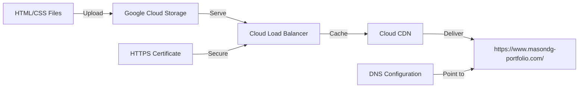

# Software Design Document: Cloud Resume Challenge Front-End

## 1. Introduction

### 1.1 Purpose
This document outlines the design specifications for the front-end component of the Cloud Resume Challenge project. The front-end consists of a static website that will serve as an online resume.

### 1.2 Scope
The front-end design covers the HTML structure, CSS styling, and deployment of a static website using Google Cloud Storage, with additional configurations for HTTPS and custom domain support.

### 1.3 Definitions, Acronyms, and Abbreviations
- HTML: HyperText Markup Language
- CSS: Cascading Style Sheets
- GCS: Google Cloud Storage
- CDN: Content Delivery Network
- DNS: Domain Name System
- HTTPS: HyperText Transfer Protocol Secure

## 2. System Overview

The front-end of the Cloud Resume Challenge project is a static website that displays the user's professional resume. It will be hosted on Google Cloud Storage and made accessible via a custom domain with HTTPS security.

## 3. Design Considerations

### 3.1 Assumptions and Dependencies
- The user has basic knowledge of HTML and CSS
- Access to a Google Cloud Platform account
- A registered domain name for the resume website

### 3.2 General Constraints
- The website must be static (no server-side processing)
- Must use Google Cloud Storage for hosting
- Must implement HTTPS using Google Cloud Load Balancer

## 4. Architectural Design

### 4.1 Component Diagram

### 4.2 Component Descriptions
1. HTML/CSS Files: Contains the structure and styling of the resume
2. Google Cloud Storage: Hosts the static website files
3. Cloud Load Balancer: Manages traffic and enables HTTPS
4. Cloud CDN: Caches content for improved performance
5. Custom Domain: Provides a user-friendly URL for accessing the resume

## 5. User Interface Design

### 5.1 HTML Structure
The HTML file should include:
- Semantic HTML5 tags for proper document structure
- Sections for personal information, work experience, education, skills, etc.
- Meta tags for SEO optimization

### 5.2 CSS Styling
The CSS file should:
- Provide a clean, professional layout
- Ensure responsive design for various screen sizes
- Use appropriate color scheme and typography for readability

## 6. Detailed Design
### Design Overview
The frontend of the application is designed with modern CSS techniques to ensure a responsive and user-friendly interface. The following technologies and methodologies are used:

### 6.2 CSS Implementation
`styles.css` - The frontend uses modern CSS techniques to create a responsive and interactive user interface.

The technologies and methodologies used are:
- **CSS Grid**: Used for the overall layout of the page, providing a flexible and efficient way to arrange content.
- **Flexbox**: Employed for navigation and other components that require alignment and distribution of space.
- **Custom Properties (CSS Variables)**: Used for theme colors to ensure consistency and easy theming across the application.
- **Transitions**: Applied to interactive elements to enhance user experience with smooth animations.

### 6.3 Deployment Process
1. Create a Google Cloud Storage bucket
2. Upload HTML and CSS files to the bucket
3. Configure the bucket for static website hosting
4. Set up a Cloud Load Balancer with HTTPS configuration
5. Enable Cloud CDN for the load balancer backend
6. Configure DNS settings to point the custom domain to the load balancer IP

## 7. Testing and Quality Assurance

### 7.1 Testing Strategy
- Validate HTML and CSS using W3C validators
- Test responsiveness across various devices and browsers
- Verify HTTPS implementation and certificate validity
- Check CDN caching effectiveness

### 7.2 Test Cases
1. Load resume in desktop and mobile browsers
2. Verify all links and sections are accessible
3. Confirm HTTPS is working (green padlock in browser)
4. Test load times from different geographic locations

## 8. Future Enhancements

- Implement a CSS framework for more advanced styling
- Add print-friendly CSS styles
- Integrate with backend services for dynamic content (visitors counter, etc.)